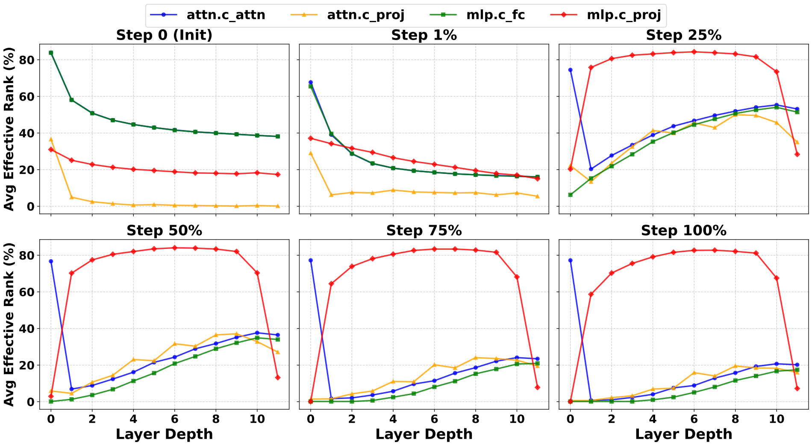
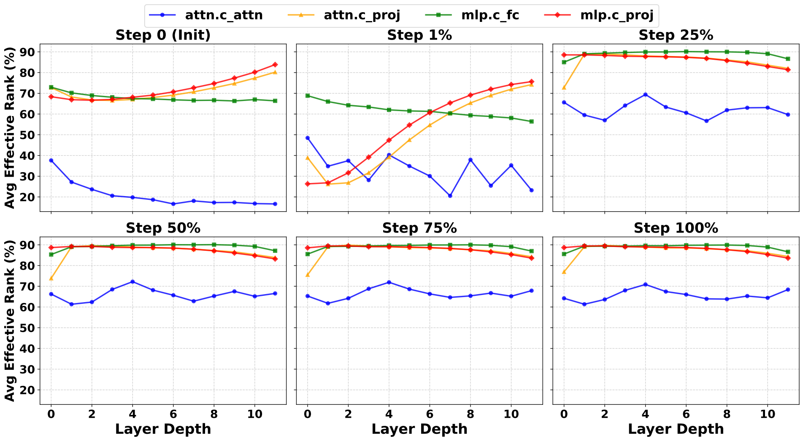

# Muon Rank Analysis for nanoGPT

A research codebase built on top of [nanoGPT](https://github.com/karpathy/nanoGPT) and [modded-nanogpt](https://github.com/KellerJordan/modded-nanogpt) to study the **effective rank dynamics** of weight activations and gradients throughout GPT-2 training under different optimizers.

---

## What This Does

We measure the **effective rank** of the input activation covariance (or gradient covariance) at each linear layer of the GPT-2 model during training, sampled at key training milestones (0%, 1%, 25%, 50%, 75%, and 100% of training). These measurements are then visualized across all 12 transformer layers to reveal how information dimensionality evolves during learning.

### Key Components

| File | Purpose |
|------|---------|
| `model.py` | GPT-2 (124M) with Rotary embeddings, adapted from nanoGPT and modded-nanogpt |
| `optimizer.py` | `Muon` and `Muon_Rank` optimizers |
| `train.py` | Training loop supporting AdamW, SGD, Muon, and Muon_Rank |
| `plot_ranks.py` | Parses the training log and renders the rank evolution figure |
| `configurator.py` | Command-line / config-file override system |
| `run.sh` | Example multi-GPU launch script |
| `config/` | Training configuration presets |
| `data/` | Dataset download and preparation scripts |

### The `Muon_Rank` Optimizer

`Muon_Rank` (in `optimizer.py`) is a diagnostic extension of the [Muon optimizer](https://github.com/KellerJordan/modded-nanogpt). It attaches forward/backward hooks to every `nn.Linear` layer and accumulates a running covariance matrix of either:
- **`mode='x'`** — input activations $X$, i.e. $\Sigma_x = X^T X / B$
- **`mode='g'`** — output gradients $G$, i.e. $\Sigma_g = G^T G / B$

At predefined iterations the effective rank is computed via eigenvalue decomposition and printed to stdout:

$$\text{eff. rank} = \min\left\lbrace k : \frac{\sum_{i=1}^{k} \lambda_i}{\sum_{i} \lambda_i} \geq 0.95 \right\rbrace$$

This rank is then parsed from the log file and plotted.

---

## Installation

```bash
pip install torch numpy datasets tiktoken wandb tqdm matplotlib pandas huggingface_hub
```

Or install all pinned dependencies:

```bash
pip install -r requirements.txt
```

---

## Quick Start

### Step 1 — Prepare the dataset

Download and tokenize the FineWeb-10B dataset (≈900M tokens, 9 chunks):

```bash
python data/fineweb-10b/prepare.py 9
```

For the full 10B token dataset:

```bash
python data/fineweb-10b/prepare.py
```

This creates `train.bin` and `val.bin` under `data/fineweb-10b/`.

### Step 2 — Run rank analysis training

**Multi-GPU (recommended, 4 GPUs):**

```bash
torchrun --standalone --nproc_per_node=4 --tee 3 --log_dir ./tmp/torchrun-logs-muon-rank \
    train.py config/train_gpt2_muon_rank.py > "nanogpt_muon_rank.log" 2>&1
```

**Single GPU:**

```bash
python train.py config/train_gpt2_muon_rank.py > "nanogpt_muon_rank.log" 2>&1
```

The training config (`config/train_gpt2_muon_rank.py`) uses the `muon_rank` optimizer with `rank_analysis_mode='x'` and runs for 7,500 iterations on FineWeb-10B. Rank measurements are printed at iterations corresponding to 0%, 1%, 25%, 50%, 75%, and 100% of training.

### Step 3 — Plot the results

```bash
python plot_ranks.py "nanogpt_muon_rank.log"
```

This produces `nanogpt_ranks.pdf` in the current directory.

---

## Training Configurations

Three preset configs are provided under `config/`:

| Config | Optimizer | Purpose |
|--------|-----------|---------|
| `train_gpt2.py` | AdamW | Baseline GPT-2 training |
| `train_gpt2_muon.py` | Muon | Muon optimizer training |
| `train_gpt2_muon_rank.py` | Muon_Rank | Rank analysis (this is the main experiment) |

To switch optimizers, pass the appropriate config:

```bash
torchrun --standalone --nproc_per_node=4 train.py config/train_gpt2_muon.py
```

---

## Sample Output

After running `plot_ranks.py`, a **2×3 grid of plots** is saved (one panel per training stage), showing the average effective rank (%) per layer for all four weight components across training. Below are two example runs on GPT-2 (124M) pretrained on FineWeb-10B with the Muon optimizer.

### Input Activation Covariance (`mode='x'`)

Rank of $\Sigma_x = X^T X / B$ — captures how much of the input activation space is actually being used at each layer.



### Gradient Covariance (`mode='g'`)

Rank of $\Sigma_g = G^T G / B$ — captures the dimensionality of the gradient signal flowing back through each layer.



## Advanced Usage

### Changing the analysis mode

To analyze gradient covariance instead of input activations, edit `config/train_gpt2_muon_rank.py`:

```python
rank_analysis_mode = 'g'  # 'x' for activations, 'g' for gradients
```

### Adjusting the rank energy threshold

The default effective rank threshold is 95% cumulative energy. To change it, modify `analyze_rank` in `optimizer.py`:

```python
@staticmethod
def analyze_rank(cov, threshold=0.95):  # change threshold here
```

---

## Acknowledgements

- GPT-2 model architecture adapted from [nanoGPT](https://github.com/karpathy/nanoGPT) by Andrej Karpathy
- Muon optimizer and RoPE embeddings adapted from [modded-nanogpt](https://github.com/KellerJordan/modded-nanogpt) by Keller Jordan
- FineWeb-10B dataset from [kjj0/fineweb10B-gpt2](https://huggingface.co/datasets/kjj0/fineweb10B-gpt2) on Hugging Face
